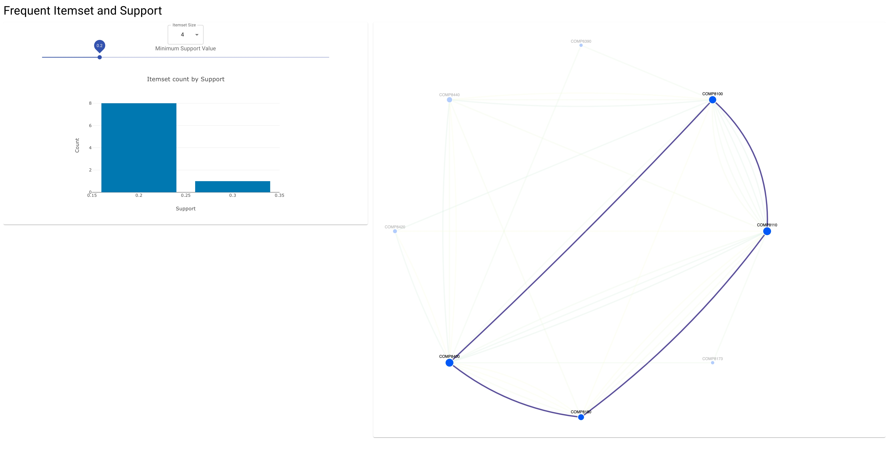

# About

Visualisation of frequent itemsets.

- Node size is a function of the number of frequent itemsets it is a member of.
- Edge color represents the support of the frequent itemset.
- How to use
  1. User selects desired itemset size and minimum support value
  2. Identify distribution of support among itemsets
  3. Click on an edge to highlight the itemset of interest

# Getting Started 

```
npm install
npm start
```
